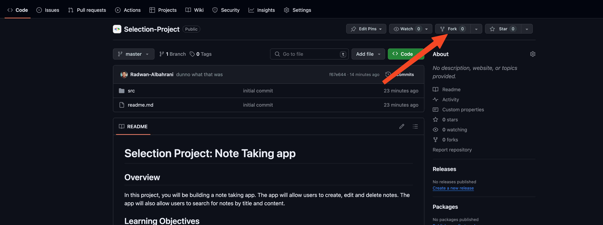
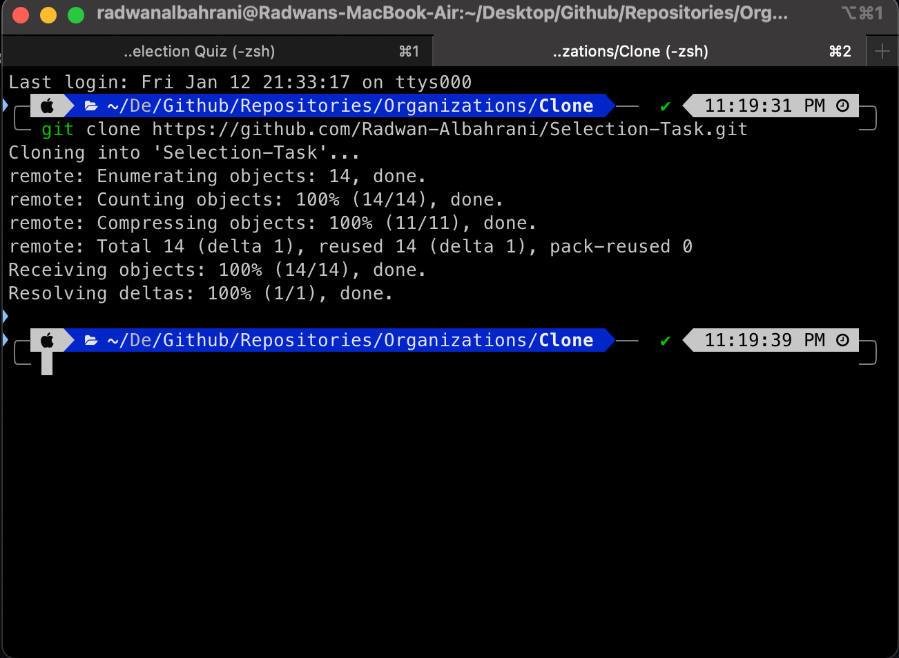

#  

# Selection Project

## Table of Contents

TODO:

## Overview

TODO:

## Learning Objectives

- Learn how to use Git and Github.
- Learn how to use Python to scrape data from the internet.
- Learn how to use Python to analyze data.
- Learn how to use Jupyter Notebooks.

## Resources

### Online Resources

#### Github

- [Git and Github](https://www.youtube.com/watch?v=tRZGeaHPoaw)
- [Git Tutorial (w3schools.com)](https://www.w3schools.com/git/default.asp)
- [How to Use Git and GitHub – Introduction for Beginners (freecodecamp.org)](https://www.freecodecamp.org/news/introduction-to-git-and-github/)
- [Learn Git Branching](https://learngitbranching.js.org/) (Interactive tutorial)
- [Git - Basic Branching and Merging (git-scm.com)](https://git-scm.com/book/en/v2/Git-Branching-Basic-Branching-and-Merging)
- [Pull Requests in VS Code - YouTube](https://www.youtube.com/watch?v=LdSwWxVzUpo)

#### Python

- TODO:

### Custom Resources

- [Selenium Tutorial](https://www.youtube.com/playlist?list=PL2zBjIlLXAP3-AoRoGOCyPW85H9xFhFwE)

## Setup and Tutorial

### 1. Setup

#### 1.1. Install Git (Windows Users Only)

- [Download Git](https://git-scm.com/downloads)

#### 1.2. Install Python

##### 1.2.1. Windows (Using Chocolaty)

- Open powershell as an administrator.

  

- Run the following command to install Chocolaty:

```bash
Set-ExecutionPolicy Bypass -Scope Process -Force; [System.Net.ServicePointManager]::SecurityProtocol = [System.Net.ServicePointManager]::SecurityProtocol -bor 3072; iex ((New-Object System.Net.WebClient).DownloadString('https://community.chocolatey.org/install.ps1'))
```

- Run the following command to install Python:

```bash
choco install python
```

- Check if Python is installed properly by running the following command:

```bash
python --version
```

##### 1.2.2. MacOS (Using Homebrew)

By default, python is already installed in macOS systems. However, if you want to use the latest version of python, you can install it using Homebrew.

- Open the terminal.

- Run the following command to install Homebrew:

```bash
/bin/bash -c "$(curl -fsSL https://raw.githubusercontent.com/Homebrew/install/HEAD/install.sh)"
```

- Run the following command to install Flutter:

```bash
brew install python
```


- Check if Python is installed properly by running the following command:

```bash
python3.X --version
```

where `X` is the version of python you installed.

#### 1.3. Install VS Code

- [Download VS Code](https://code.visualstudio.com/download)

#### 1.4 Fork the repository

- Fork the repository by clicking the fork button on the top right corner of the repository page.
  - Click the fork Button

  

  - Name the repo and click "Create fork"
  

  - You should now have a copy of the repository on your own account.
  

### Tutorial

#### 2.1. Git

##### 2.1.1. Clone the repository

- Open the terminal and navigate to the directory (also known as folder) where you want to clone the repository.
  - Make sure the path you choose has NO ARABIC LETTERS. This will cause errors.
    - On Mac:
  
    - On Windows:
  
- Go to the repository page on **your own account** and click on the green code button.
- Copy the link under the clone section.

- Run the following command inside of the opened terminal to clone the repository:

```bash
git clone <The Link from your Repository>
```

Example:

```bash
git clone https://github.com/YOUR_NAME/Selection-Project.git
```



##### 2.1.2. Add changes

- Open the repository directory in VS Code.
  - The path must be INSIDE the cloned repository.
  - Click on File -> Open folder
  
  - Select the repository folder.
  
  - The repository should be opened in VS Code.
  
  - To make sure, run the following command in the terminal INSIDE Vscode:

  ```bash
  git status
  ```

  - The output should be similar to the following:
  

---------------------------------------------------------------------------------------------------------------------------------------------------------------------------------

#### You are now ready to code! Make the required changes which are given in section [Project Overview](#project-overview) and then follow the steps below to push your changes to Github. Make sure to regularly commit your changes. If you want to continue the tutorial, skip to section [2.2. Python](#22-python)

---------------------------------------------------------------------------------------------------------------------------------------------------------------------------------

- Run the following command to add the changes:

```bash
git add .
```

##### 2.1.3. Commit changes

- Run the following command to commit the changes:

```bash
git commit -m "<commit-message>"
```

##### 2.1.4. Push changes

- Run the following command to push the changes:

```bash
git push
```


##### 2.1.5. Create a pull request

- Go to the repository page and click on the pull request button.

- Click on the new pull request button.

- Select the branch you want to merge into the main branch.

- Click on the create pull request button.

- Add a title and description for the pull request. Title should be in the following format: `<your-name> - <project-name>`.

- Click on the create pull request button.


#### 2.2. Python

You can find starter python tutorials [here](./Tutorial/).

##### 2.2.6. Code Structuring and Formatting

- Code should be structured and formatted properly.
- Code should be divided into functions and classes.
- Functions and classes should be named properly.
- Functions and classes should be defined before they are used.

An example code structure is provided within the repository itself.

## Project Overview

Your task is to create a Sentiment Analyzer program using reviews from either a movie, book, or game that you like. You can use whatever method you please to scrape data from the internet. The final submission should be a jupyter notebook analyzing the reviews of the movie, book, or game you chose.

An example of a sentiment analyzer can be found [here](https://github.com/Radwan-Albahrani/Sentiment-Analyzer).

### Requirements

The notebook should contain the following:

- A description of the project.
- A description of the dataset used.
- A description of the methods used to scrape the data.
- A description of the methods used to analyze the data.
- A description of the results.

Some libraries that you might find useful:

- [Selenium](https://www.selenium.dev/documentation/)
- [Pandas](https://pypi.org/project/pandas/)
- [TextBlob](https://textblob.readthedocs.io/en/dev/)

## Submission Guidelines

- The app should be pushed to Github and a pull request should be created. You can check how to push your code to Github in section [2.1.2 Add Changes](#212-add-changes)
- The pull request title should be in the following format: `<your-name> - <project-name>`. You can check how to make a pull request in section [2.1.5. Create a pull request](#215-create-a-pull-request).
- The pull request description should contain the following:
  - A description of the changes made.
  - A screenshot of the app running in the terminal.
